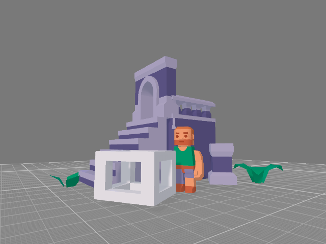

<table>
  <tbody>
    <tr>
      <td><b>About 👾</b></td>
      <td width="50%" rowspan="4">
        
      </td>
    </tr>
    <tr>
      <td width="50%">
        

            This repository is a collection of simple, games developed using raylib,
            with C++.
        

        

            It's a playground for exploring and experimenting with game development ideas. 
            Whether you're a developer seeking inspiration or just looking, 
            this repository contains, lightweight projects, experiments and so on.
        

      </td>
    </tr>
    <tr>
        <td>
            <b>🧙</b>
            <a href="https://github.com/LinMAD/OpenGames/tree/old-master">Old branch with "games" made with SDL2 and SFML</a>
        </td>
    </tr>
  </tbody>
</table>

---

<table>
    <tr>
        <td>
            
        </td>
        <td>
            

                Simple <a href="Games/Demo">Demo</a> that demonstration implemented features of <a href="Core">Core</a>
            

        </td>
    </tr>
</table>
